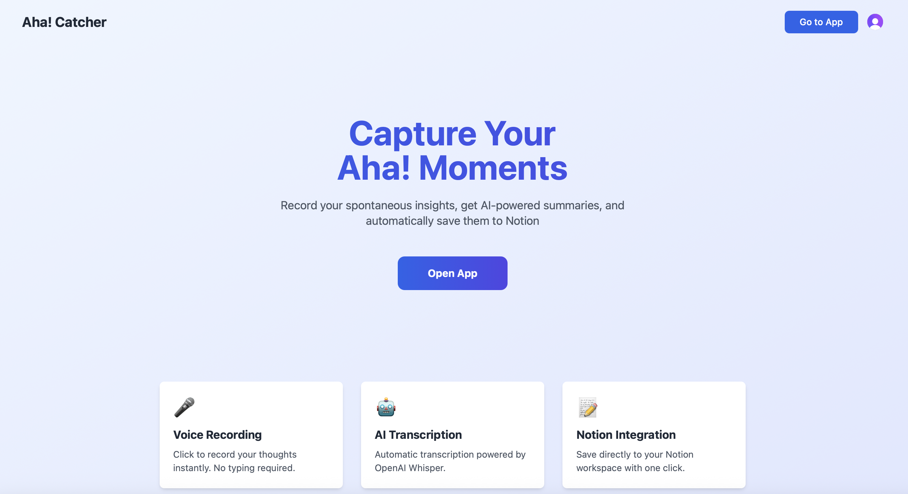
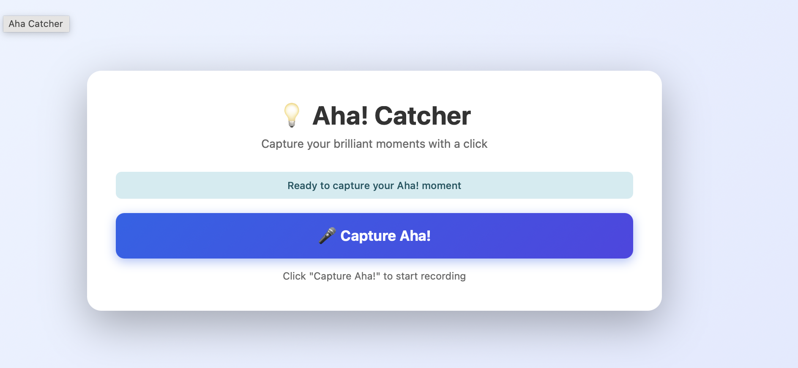

# Aha! Catcher

Capture your brilliant moments with a click. Record spontaneous insights, get AI-powered transcriptions and research summaries, and save them to your personal notes database.




## Features

- **Voice Recording** - Click-to-record with a 30-second circular buffer to capture your thoughts instantly
- **AI Transcription** - Automatic speech-to-text powered by OpenAI Whisper
- **Research Summary** - AI-generated summaries and research insights via Super Mind API
- **Save Insights** - Save your insights to your personal notes database, accessible across devices
- **User Authentication** - Secure access with Clerk authentication

## Tech Stack

### Frontend
- [Next.js 15](https://nextjs.org/) - React framework with App Router
- [React 19](https://react.dev/) - UI library
- [Tailwind CSS](https://tailwindcss.com/) - Styling
- [Clerk](https://clerk.com/) - Authentication

### Backend
- [FastAPI](https://fastapi.tiangolo.com/) - Python API framework
- [OpenAI Whisper](https://openai.com/research/whisper) - Speech-to-text
- [Supabase](https://supabase.com/) - Database for storing insights

### Deployment
- [Vercel](https://vercel.com/) - Hosting (Next.js + Python serverless functions)

## Getting Started

### Prerequisites

- Node.js 18+
- Python 3.9+
- API keys for:
  - [OpenAI](https://platform.openai.com/) (Whisper transcription)
  - [Super Mind](https://space.ai-builders.com/) (summarization)
  - [Supabase](https://supabase.com/) (database)
  - [Clerk](https://dashboard.clerk.com/) (authentication)

### Installation

1. **Clone the repository**
   ```bash
   git clone https://github.com/jjqians66/aha_moment_catcher.git
   cd aha_moment_catcher
   ```

2. **Install Node.js dependencies**
   ```bash
   npm install
   ```

3. **Install Python dependencies**
   ```bash
   pip install -r requirements.txt
   ```

4. **Configure environment variables**

   Create `.env` file (for Python APIs):
   ```bash
   cp .env.example .env
   ```

   Create `.env.local` file (for Next.js/Clerk):
   ```bash
   cp .env.local.example .env.local
   ```

   Fill in your API keys in both files.

5. **Run the development server**
   ```bash
   npm run dev
   ```

   Open [http://localhost:3000](http://localhost:3000) in your browser.

## Project Structure

```
aha_catcher/
├── app/                    # Next.js App Router pages
│   ├── layout.tsx          # Root layout with Clerk provider
│   ├── page.tsx            # Landing page
│   ├── product/            # Protected product page
│   ├── sign-in/            # Sign-in page
│   └── sign-up/            # Sign-up page
├── api/                    # Python serverless functions
│   ├── transcribe.py       # Whisper transcription endpoint
│   ├── summarize.py        # AI summary endpoint
│   ├── insights_save.py    # Save insight endpoint
│   └── insights_list.py    # List/delete insights endpoint
├── public/
│   └── product.html        # Main app interface
├── clerk_auth.py           # Clerk JWT validation for Python
├── supabase_client.py      # Supabase client helper
├── whisper_wrapper.py      # OpenAI Whisper client
├── middleware.ts           # Clerk middleware for route protection
└── vercel.json             # Vercel deployment configuration
```

## API Endpoints

| Endpoint | Method | Description |
|----------|--------|-------------|
| `/api/transcribe` | POST | Transcribe audio file using Whisper |
| `/api/summarize` | POST | Generate AI research summary |
| `/api/insights/save` | POST | Save insight to database |
| `/api/insights` | GET | List user's insights |
| `/api/insights/{id}` | GET | Get a single insight |
| `/api/insights/{id}` | DELETE | Delete an insight |

All endpoints require authentication via Clerk JWT token in the `Authorization` header.

## Deployment

### Deploy to Vercel

1. Push your code to GitHub
2. Import the repository in [Vercel](https://vercel.com/new)
3. Add environment variables in Vercel dashboard:
   - `OPENAI_API_KEY`
   - `SUPER_MIND_API_KEY`
   - `SUPABASE_URL`
   - `SUPABASE_SERVICE_ROLE_KEY`
   - `CLERK_SECRET_KEY`
   - `CLERK_JWKS_URL`
   - `NEXT_PUBLIC_CLERK_PUBLISHABLE_KEY`
4. Deploy

## Usage

1. **Sign in** - Create an account or sign in with your existing credentials
2. **Record** - Click "Capture Aha!" to start recording your voice
3. **Stop** - Click again to stop and get automatic transcription
4. **Summarize** - Click "Send to GPT" to generate a research summary
5. **Save** - Click "Save Insight" to save to your personal notes database
6. **View** - Click "My Notes" to view all your saved insights

## License

MIT

## Author

Built by [@jjqians66](https://github.com/jjqians66)
